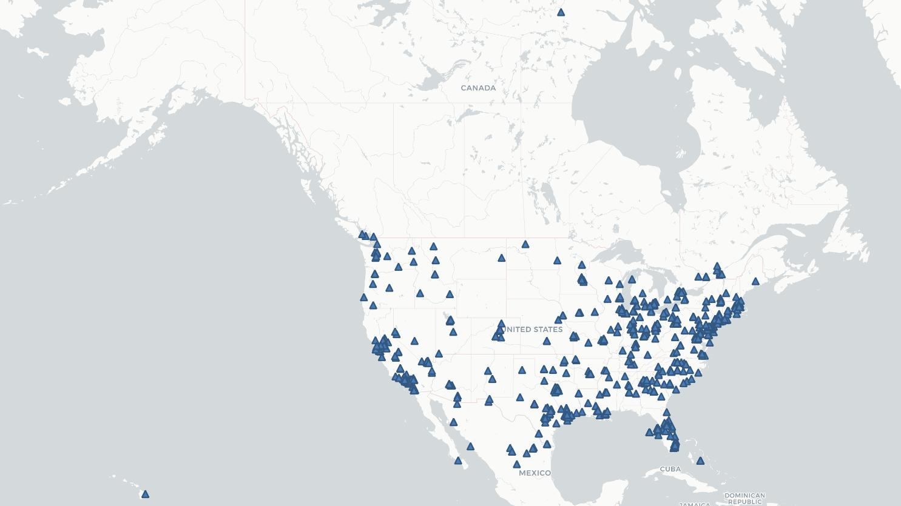
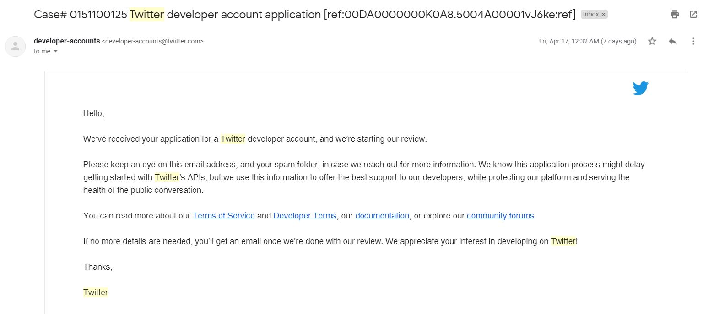
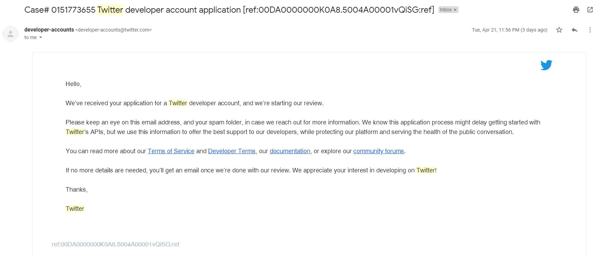

# Analysis on the Collected Data

The **second** lab assignment of GEOG 458 is making an analysis on the collected data that were given from the geo-tagged tweets using a API-based Crawler.

### :telescope: Map of the Data

The map represents every single Tweet collected from the United States and one from Canada. Since the data holds the locational information, it can be plotted on the map as a small, blue triangle.

### :memo: Analysis
- There are clustered triangles near the **East coast and West coast**.
  - This would mean that *more populated* states such as New York, Delaware, Florida, and California had more chances to show up while the Crawler was running.
- There is only **one** triangle in Canada.
  - This might be an *error* in Twitter for tracking the location as the majority of data was limited to the United States.
- **Northeastern** regions tend to have more triangles than any other places.
  - The current *Covid-19* issue would influence people in these regions to share emotions and thoughts more often, which eventually made more outputs in the data.

### :speech_balloon: Comments on this Assignment
> Basemap of the map

When I working on this assignment, I found that the guideline asked to have `Dark Matter (retina)` under `CartoDB`. However, the map embeded in the instruction was using the other basemap, `Positron (retina)`. I have decided to use `Positron (retina)` as the basemap because it is the one used in the instruction and it is easy to read the label.

> Accessing Twitter Developer account

I got a problem in accessing the Twitter Developer account due to the delays in reviewing my application. Therefore, I copied the `geosearch.ipynb` to my repository and used  `sample.csv` file for making the map.

I attached the proof that I have applied to the Developer account using two Twitter accounts.

